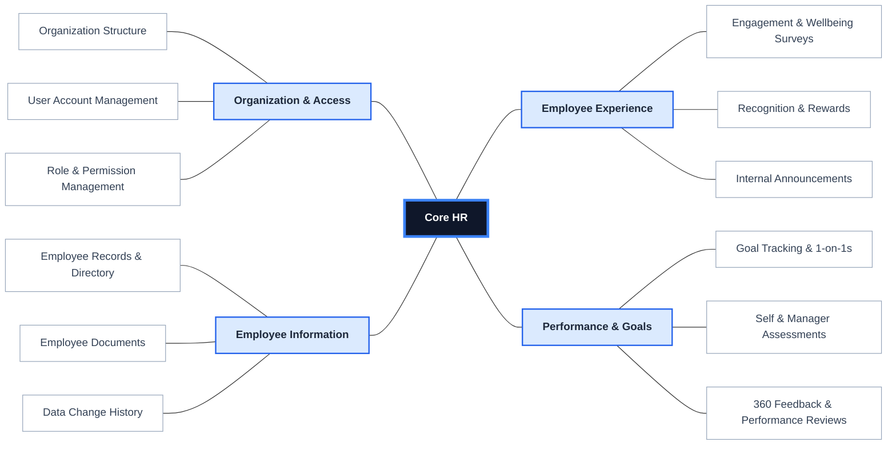
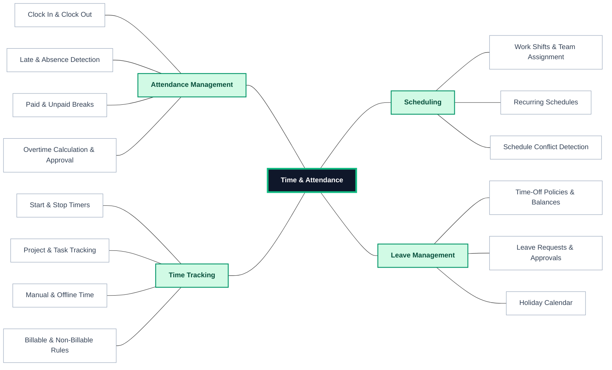
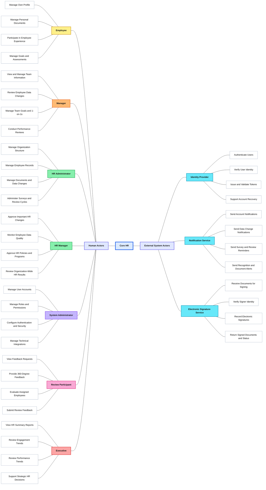
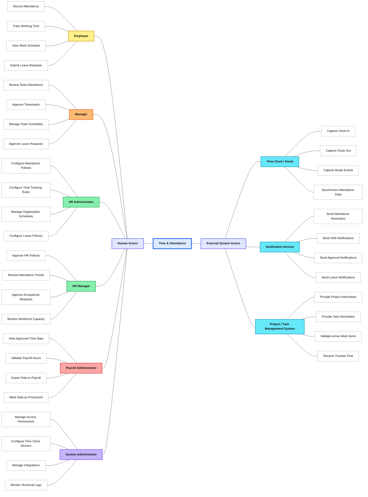
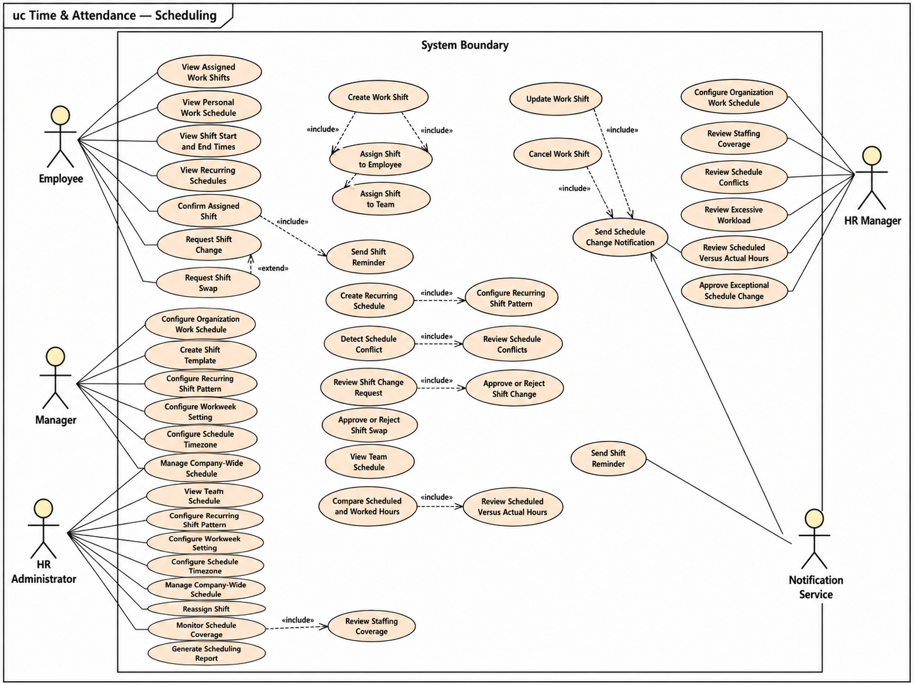

```mermaid
flowchart LR

    %% =====================================================
    %% CENTER
    %% =====================================================

    HR["HR Platform"]

    %% =====================================================
    %% LEFT SIDE — MAIN MODULES (4 MODULES)
    %% =====================================================

    CORE["Core HR"] --- HR
    RECRUITMENT["Recruitment & Onboarding"] --- HR
    GOVERNANCE["Platform & Governance"] --- HR
    ANALYTICS["Analytics & AI"] --- HR

    %% =====================================================
    %% CORE HR
    %% =====================================================

    ORGANIZATION["Organization & Access"] --- CORE
    EMPLOYEE_INFO["Employee Information"] --- CORE
    EXPERIENCE["Employee Experience"] --- CORE
    PERFORMANCE["Performance & Goals"] --- CORE

    OA1["Organization Structure"] --- ORGANIZATION
    OA2["User Account Management"] --- ORGANIZATION
    OA3["Role & Permission Management"] --- ORGANIZATION

    EI1["Employee Records & Directory"] --- EMPLOYEE_INFO
    EI2["Employee Documents"] --- EMPLOYEE_INFO
    EI3["Data Change History"] --- EMPLOYEE_INFO

    EE1["Engagement & Wellbeing Surveys"] --- EXPERIENCE
    EE2["Recognition & Rewards"] --- EXPERIENCE
    EE3["Internal Announcements"] --- EXPERIENCE

    PG1["Goal Tracking & 1-on-1s"] --- PERFORMANCE
    PG2["Self & Manager Assessments"] --- PERFORMANCE
    PG3["360 Feedback & Performance Reviews"] --- PERFORMANCE

    %% =====================================================
    %% RECRUITMENT & ONBOARDING
    %% =====================================================

    HIRING["Hiring & ATS"] --- RECRUITMENT
    ONBOARDING["Onboarding & Offboarding"] --- RECRUITMENT

    HA1["Job Opening Management"] --- HIRING
    HA2["Candidate Pipeline & Interviews"] --- HIRING
    HA3["Candidate Evaluation"] --- HIRING
    HA4["Offer Management"] --- HIRING

    OO1["New-Hire Information Collection"] --- ONBOARDING
    OO2["Onboarding Checklists"] --- ONBOARDING
    OO3["Electronic Signatures"] --- ONBOARDING
    OO4["Access & Equipment Recovery"] --- ONBOARDING

    %% =====================================================
    %% PLATFORM & GOVERNANCE
    %% =====================================================

    COMPLIANCE["Compliance & Security"] --- GOVERNANCE
    INTEGRATIONS["Integrations & Workflows"] --- GOVERNANCE

    CS1["Secure Authentication, 2FA & SSO"] --- COMPLIANCE
    CS2["Role-Based Access Control"] --- COMPLIANCE
    CS3["Privacy & Audit Logs"] --- COMPLIANCE

    IW1["Public API & Webhooks"] --- INTEGRATIONS
    IW2["Payroll & Accounting Integrations"] --- INTEGRATIONS
    IW3["Multi-Level Approval Engine"] --- INTEGRATIONS
    IW4["Dashboards & Notifications"] --- INTEGRATIONS

    %% =====================================================
    %% ANALYTICS & AI
    %% =====================================================

    REPORTING["Reporting & Analytics"] --- ANALYTICS
    INTELLIGENCE["HR Intelligence & AI"] --- ANALYTICS

    RA1["HR & Recruitment Reports"] --- REPORTING
    RA2["Time, Attendance & Cost Reports"] --- REPORTING
    RA3["Custom Dashboards & Export"] --- REPORTING

    AI1["Natural Language Questions"] --- INTELLIGENCE
    AI2["Policy & Document Search"] --- INTELLIGENCE
    AI3["Workforce Trend & Anomaly Detection"] --- INTELLIGENCE
    AI4["Data-Driven Recommendations"] --- INTELLIGENCE

    %% =====================================================
    %% RIGHT SIDE — MAIN MODULES (3 MODULES)
    %% =====================================================

    HR --- TIME["Time & Attendance"]
    HR --- TRACKING["Workforce Tracking"]
    HR --- PAYROLL["Payroll & Benefits"]

    %% =====================================================
    %% TIME & ATTENDANCE
    %% =====================================================

    TIME --- ATTENDANCE["Attendance Management"]
    TIME --- TIME_TRACKING["Time Tracking"]
    TIME --- SCHEDULING["Scheduling"]
    TIME --- LEAVE["Leave Management"]

    ATTENDANCE --- AM1["Clock In & Clock Out"]
    ATTENDANCE --- AM2["Late & Absence Detection"]
    ATTENDANCE --- AM3["Paid & Unpaid Breaks"]
    ATTENDANCE --- AM4["Overtime Calculation & Approval"]

    TIME_TRACKING --- TT1["Start & Stop Timers"]
    TIME_TRACKING --- TT2["Project & Task Tracking"]
    TIME_TRACKING --- TT3["Manual & Offline Time"]
    TIME_TRACKING --- TT4["Billable & Non-Billable Rules"]

    SCHEDULING --- SC1["Work Shifts & Team Assignment"]
    SCHEDULING --- SC2["Recurring Schedules"]
    SCHEDULING --- SC3["Schedule Conflict Detection"]

    LEAVE --- LM1["Time-Off Policies & Balances"]
    LEAVE --- LM2["Leave Requests & Approvals"]
    LEAVE --- LM3["Holiday Calendar"]

    %% =====================================================
    %% WORKFORCE TRACKING
    %% =====================================================

    TRACKING --- ACTIVITY["Activity & Productivity"]
    TRACKING --- LOCATION["Location & Field Operations"]

    ACTIVITY --- AP1["Keyboard & Mouse Activity"]
    ACTIVITY --- AP2["Screenshot Capture"]
    ACTIVITY --- AP3["Application & Website Tracking"]
    ACTIVITY --- AP4["Idle Time & Focus Analysis"]

    LOCATION --- LF1["Real-Time GPS Tracking"]
    LOCATION --- LF2["Location & Route History"]
    LOCATION --- LF3["Geofence Clock-In"]
    LOCATION --- LF4["Field Attendance Tracking"]

    %% =====================================================
    %% PAYROLL & BENEFITS
    %% =====================================================

    PAYROLL --- PAYROLL_PROCESS["Payroll Processing"]
    PAYROLL --- COMPENSATION["Compensation & Benefits"]
    PAYROLL --- BILLING["Client Billing & Expenses"]

    PAYROLL_PROCESS --- PP1["Pay Rates & Hourly/Salary Pay"]
    PAYROLL_PROCESS --- PP2["Payroll from Approved Timesheets"]
    PAYROLL_PROCESS --- PP3["Payroll Tax & Direct Deposit"]
    PAYROLL_PROCESS --- PP4["Payroll History"]

    COMPENSATION --- CB1["Salary Bands & Reviews"]
    COMPENSATION --- CB2["Benefit Plan Eligibility"]
    COMPENSATION --- CB3["Open & New-Hire Enrollment"]

    BILLING --- BE1["Billable Hours & Rates"]
    BILLING --- BE2["Invoice Generation & Delivery"]
    BILLING --- BE3["Expense Reimbursement & Invoicing"]

    %% =====================================================
    %% STYLES BY LAYER & HIGHLIGHTS
    %% =====================================================

    classDef center fill:#0f172a,stroke:#38bdf8,stroke-width:4px,color:#ffffff,font-weight:bold;
    classDef layer1 fill:#2563eb,stroke:#1d4ed8,stroke-width:3px,color:#ffffff,font-weight:bold;
    classDef highlightLayer1 fill:#f59e0b,stroke:#b45309,stroke-width:4px,color:#ffffff,font-weight:bold;
    classDef layer2 fill:#dbeafe,stroke:#3b82f6,stroke-width:2px,color:#1e293b,font-weight:bold;
    classDef layer3 fill:#ffffff,stroke:#94a3b8,stroke-width:1px,color:#334155;

    class HR center;

    class CORE,TIME highlightLayer1;
    class RECRUITMENT,GOVERNANCE,ANALYTICS,TRACKING,PAYROLL layer1;

    class ORGANIZATION,EMPLOYEE_INFO,EXPERIENCE,PERFORMANCE,HIRING,ONBOARDING,COMPLIANCE,INTEGRATIONS,REPORTING,INTELLIGENCE,ATTENDANCE,TIME_TRACKING,SCHEDULING,LEAVE,ACTIVITY,LOCATION,PAYROLL_PROCESS,COMPENSATION,BILLING layer2;

    class OA1,OA2,OA3,EI1,EI2,EI3,EE1,EE2,EE3,PG1,PG2,PG3,HA1,HA2,HA3,HA4,OO1,OO2,OO3,OO4,CS1,CS2,CS3,IW1,IW2,IW3,IW4,RA1,RA2,RA3,AI1,AI2,AI3,AI4,AM1,AM2,AM3,AM4,TT1,TT2,TT3,TT4,SC1,SC2,SC3,LM1,LM2,LM3,AP1,AP2,AP3,AP4,LF1,LF2,LF3,LF4,PP1,PP2,PP3,PP4,CB1,CB2,CB3,BE1,BE2,BE3 layer3;
```

# Mindmap for Core HR 

# Mindmap for Time & Attendance 

# Actors, Funtionals Mindmap for Core HR

# Actors, Funtionals Mindmap for Time & Attedence

# Usecase Diagram for CoreHR
## Organization & Access

## Employee Infomation

## Employee Experience 

## Performance & Goal Management

# Usecase Diagram for Time & Attendance
## Attendance Management

## Time Tracking

## Scheduling

## Leave Management 

