```mermaid
flowchart LR

    %% =====================================================
    %% CENTER
    %% =====================================================

    HR["HR Platform"]

    %% =====================================================
    %% LEFT SIDE — MAIN MODULES (4 MODULES)
    %% =====================================================

    CORE["Core HR"] --- HR
    RECRUITMENT["Recruitment & Onboarding"] --- HR
    GOVERNANCE["Platform & Governance"] --- HR
    ANALYTICS["Analytics & AI"] --- HR

    %% =====================================================
    %% CORE HR
    %% =====================================================

    ORGANIZATION["Organization & Access"] --- CORE
    EMPLOYEE_INFO["Employee Information"] --- CORE
    EXPERIENCE["Employee Experience"] --- CORE
    PERFORMANCE["Performance & Goals"] --- CORE

    OA1["Organization Structure"] --- ORGANIZATION
    OA2["User Account Management"] --- ORGANIZATION
    OA3["Role & Permission Management"] --- ORGANIZATION

    EI1["Employee Records & Directory"] --- EMPLOYEE_INFO
    EI2["Employee Documents"] --- EMPLOYEE_INFO
    EI3["Data Change History"] --- EMPLOYEE_INFO

    EE1["Engagement & Wellbeing Surveys"] --- EXPERIENCE
    EE2["Recognition & Rewards"] --- EXPERIENCE
    EE3["Internal Announcements"] --- EXPERIENCE

    PG1["Goal Tracking & 1-on-1s"] --- PERFORMANCE
    PG2["Self & Manager Assessments"] --- PERFORMANCE
    PG3["360 Feedback & Performance Reviews"] --- PERFORMANCE

    %% =====================================================
    %% RECRUITMENT & ONBOARDING
    %% =====================================================

    HIRING["Hiring & ATS"] --- RECRUITMENT
    ONBOARDING["Onboarding & Offboarding"] --- RECRUITMENT

    HA1["Job Opening Management"] --- HIRING
    HA2["Candidate Pipeline & Interviews"] --- HIRING
    HA3["Candidate Evaluation"] --- HIRING
    HA4["Offer Management"] --- HIRING

    OO1["New-Hire Information Collection"] --- ONBOARDING
    OO2["Onboarding Checklists"] --- ONBOARDING
    OO3["Electronic Signatures"] --- ONBOARDING
    OO4["Access & Equipment Recovery"] --- ONBOARDING

    %% =====================================================
    %% PLATFORM & GOVERNANCE
    %% =====================================================

    COMPLIANCE["Compliance & Security"] --- GOVERNANCE
    INTEGRATIONS["Integrations & Workflows"] --- GOVERNANCE

    CS1["Secure Authentication, 2FA & SSO"] --- COMPLIANCE
    CS2["Role-Based Access Control"] --- COMPLIANCE
    CS3["Privacy & Audit Logs"] --- COMPLIANCE

    IW1["Public API & Webhooks"] --- INTEGRATIONS
    IW2["Payroll & Accounting Integrations"] --- INTEGRATIONS
    IW3["Multi-Level Approval Engine"] --- INTEGRATIONS
    IW4["Dashboards & Notifications"] --- INTEGRATIONS

    %% =====================================================
    %% ANALYTICS & AI
    %% =====================================================

    REPORTING["Reporting & Analytics"] --- ANALYTICS
    INTELLIGENCE["HR Intelligence & AI"] --- ANALYTICS

    RA1["HR & Recruitment Reports"] --- REPORTING
    RA2["Time, Attendance & Cost Reports"] --- REPORTING
    RA3["Custom Dashboards & Export"] --- REPORTING

    AI1["Natural Language Questions"] --- INTELLIGENCE
    AI2["Policy & Document Search"] --- INTELLIGENCE
    AI3["Workforce Trend & Anomaly Detection"] --- INTELLIGENCE
    AI4["Data-Driven Recommendations"] --- INTELLIGENCE

    %% =====================================================
    %% RIGHT SIDE — MAIN MODULES (3 MODULES)
    %% =====================================================

    HR --- TIME["Time & Attendance"]
    HR --- TRACKING["Workforce Tracking"]
    HR --- PAYROLL["Payroll & Benefits"]

    %% =====================================================
    %% TIME & ATTENDANCE
    %% =====================================================

    TIME --- ATTENDANCE["Attendance Management"]
    TIME --- TIME_TRACKING["Time Tracking"]
    TIME --- SCHEDULING["Scheduling"]
    TIME --- LEAVE["Leave Management"]

    ATTENDANCE --- AM1["Clock In & Clock Out"]
    ATTENDANCE --- AM2["Late & Absence Detection"]
    ATTENDANCE --- AM3["Paid & Unpaid Breaks"]
    ATTENDANCE --- AM4["Overtime Calculation & Approval"]

    TIME_TRACKING --- TT1["Start & Stop Timers"]
    TIME_TRACKING --- TT2["Project & Task Tracking"]
    TIME_TRACKING --- TT3["Manual & Offline Time"]
    TIME_TRACKING --- TT4["Billable & Non-Billable Rules"]

    SCHEDULING --- SC1["Work Shifts & Team Assignment"]
    SCHEDULING --- SC2["Recurring Schedules"]
    SCHEDULING --- SC3["Schedule Conflict Detection"]

    LEAVE --- LM1["Time-Off Policies & Balances"]
    LEAVE --- LM2["Leave Requests & Approvals"]
    LEAVE --- LM3["Holiday Calendar"]

    %% =====================================================
    %% WORKFORCE TRACKING
    %% =====================================================

    TRACKING --- ACTIVITY["Activity & Productivity"]
    TRACKING --- LOCATION["Location & Field Operations"]

    ACTIVITY --- AP1["Keyboard & Mouse Activity"]
    ACTIVITY --- AP2["Screenshot Capture"]
    ACTIVITY --- AP3["Application & Website Tracking"]
    ACTIVITY --- AP4["Idle Time & Focus Analysis"]

    LOCATION --- LF1["Real-Time GPS Tracking"]
    LOCATION --- LF2["Location & Route History"]
    LOCATION --- LF3["Geofence Clock-In"]
    LOCATION --- LF4["Field Attendance Tracking"]

    %% =====================================================
    %% PAYROLL & BENEFITS
    %% =====================================================

    PAYROLL --- PAYROLL_PROCESS["Payroll Processing"]
    PAYROLL --- COMPENSATION["Compensation & Benefits"]
    PAYROLL --- BILLING["Client Billing & Expenses"]

    PAYROLL_PROCESS --- PP1["Pay Rates & Hourly/Salary Pay"]
    PAYROLL_PROCESS --- PP2["Payroll from Approved Timesheets"]
    PAYROLL_PROCESS --- PP3["Payroll Tax & Direct Deposit"]
    PAYROLL_PROCESS --- PP4["Payroll History"]

    COMPENSATION --- CB1["Salary Bands & Reviews"]
    COMPENSATION --- CB2["Benefit Plan Eligibility"]
    COMPENSATION --- CB3["Open & New-Hire Enrollment"]

    BILLING --- BE1["Billable Hours & Rates"]
    BILLING --- BE2["Invoice Generation & Delivery"]
    BILLING --- BE3["Expense Reimbursement & Invoicing"]

    %% =====================================================
    %% STYLES BY LAYER & HIGHLIGHTS
    %% =====================================================

    classDef center fill:#0f172a,stroke:#38bdf8,stroke-width:4px,color:#ffffff,font-weight:bold;
    classDef layer1 fill:#2563eb,stroke:#1d4ed8,stroke-width:3px,color:#ffffff,font-weight:bold;
    classDef highlightLayer1 fill:#f59e0b,stroke:#b45309,stroke-width:4px,color:#ffffff,font-weight:bold;
    classDef layer2 fill:#dbeafe,stroke:#3b82f6,stroke-width:2px,color:#1e293b,font-weight:bold;
    classDef layer3 fill:#ffffff,stroke:#94a3b8,stroke-width:1px,color:#334155;

    class HR center;

    class CORE,TIME highlightLayer1;
    class RECRUITMENT,GOVERNANCE,ANALYTICS,TRACKING,PAYROLL layer1;

    class ORGANIZATION,EMPLOYEE_INFO,EXPERIENCE,PERFORMANCE,HIRING,ONBOARDING,COMPLIANCE,INTEGRATIONS,REPORTING,INTELLIGENCE,ATTENDANCE,TIME_TRACKING,SCHEDULING,LEAVE,ACTIVITY,LOCATION,PAYROLL_PROCESS,COMPENSATION,BILLING layer2;

    class OA1,OA2,OA3,EI1,EI2,EI3,EE1,EE2,EE3,PG1,PG2,PG3,HA1,HA2,HA3,HA4,OO1,OO2,OO3,OO4,CS1,CS2,CS3,IW1,IW2,IW3,IW4,RA1,RA2,RA3,AI1,AI2,AI3,AI4,AM1,AM2,AM3,AM4,TT1,TT2,TT3,TT4,SC1,SC2,SC3,LM1,LM2,LM3,AP1,AP2,AP3,AP4,LF1,LF2,LF3,LF4,PP1,PP2,PP3,PP4,CB1,CB2,CB3,BE1,BE2,BE3 layer3;
```

## Use Case Catalogue

| No. | Use Case ID | Module | Feature Group | High-Level Use Case | Actors | Functional Description |
|---:|---|---|---|---|---|---|
| 1 | UC-CORE-01 | Core HR | Organization & Access | Manage Organization Structure | Employee; Manager; HR Staff | Create and manage departments, teams, positions, job titles, reporting lines, and the organizational chart. |
| 2 | UC-CORE-02 | Core HR | Organization & Access | Manage User Accounts | Employee; HR Staff; System Administrator | Create, activate, deactivate, unlock, and recover user accounts. |
| 3 | UC-CORE-03 | Core HR | Organization & Access | Manage Roles and Permissions | HR Staff; System Administrator | Create roles, assign permissions, and configure data-access scopes. |
| 4 | UC-CORE-04 | Core HR | Employee Information | Manage Employee Records and Directory | Employee; Manager; HR Staff | Create, view, update, search, archive, and manage employee records. |
| 5 | UC-CORE-05 | Core HR | Employee Information | Manage Employee Documents | Employee; HR Staff; External System | Upload, classify, electronically sign, track, and store employee documents. |
| 6 | UC-CORE-06 | Core HR | Employee Information | View Employee Data Change History | Manager; HR Staff | Track data changes, the user who made each change, and the time of modification. |
| 7 | UC-CORE-07 | Core HR | Employee Experience | Manage Engagement and Wellbeing Surveys | Employee; Manager; HR Staff | Create surveys, distribute them, collect responses, and analyze engagement and wellbeing. |
| 8 | UC-CORE-08 | Core HR | Employee Experience | Manage Recognition and Rewards | Employee; Manager; HR Staff | Recognize contributions, nominate employees, approve rewards, and manage recognition records. |
| 9 | UC-CORE-09 | Core HR | Employee Experience | Manage Internal Announcements | Employee; HR Staff; External System | Create, approve, publish, and distribute internal announcements. |
| 10 | UC-CORE-10 | Core HR | Performance & Goals | Manage Goals and One-on-One Meetings | Employee; Manager; HR Staff | Create goals, update progress, schedule one-on-one meetings, and manage follow-up actions. |
| 11 | UC-CORE-11 | Core HR | Performance & Goals | Manage Self and Manager Assessments | Employee; Manager; HR Staff | Configure and complete self-assessments and manager assessments. |
| 12 | UC-CORE-12 | Core HR | Performance & Goals | Manage 360-Degree Feedback and Performance Reviews | Employee; Manager; HR Staff | Collect multi-source feedback, conduct review cycles, and publish performance results. |
| 13 | UC-REC-01 | Recruitment & Onboarding | Hiring & ATS | Manage Job Openings | Recruiter; Manager; HR Staff | Create, update, approve, publish, close, and archive job openings. |
| 14 | UC-REC-02 | Recruitment & Onboarding | Hiring & ATS | Manage Candidate Pipeline and Interviews | Candidate / New Hire; Recruiter; Manager | Receive applications, move candidates through the pipeline, and schedule interviews. |
| 15 | UC-REC-03 | Recruitment & Onboarding | Hiring & ATS | Evaluate Candidates | Recruiter; Manager | Score candidates, record feedback, compare candidates, and support hiring decisions. |
| 16 | UC-REC-04 | Recruitment & Onboarding | Hiring & ATS | Manage Job Offers | Candidate / New Hire; Recruiter; Manager; HR Staff; External System | Create, approve, send, sign, accept, reject, and track job offers. |
| 17 | UC-REC-05 | Recruitment & Onboarding | Onboarding & Offboarding | Collect New-Hire Information | Candidate / New Hire; HR Staff | Collect personal, banking, tax, emergency-contact, and required employment information. |
| 18 | UC-REC-06 | Recruitment & Onboarding | Onboarding & Offboarding | Manage Onboarding Checklists | Candidate / New Hire; Manager; HR Staff; System Administrator | Create onboarding checklists, assign tasks, and track onboarding progress. |
| 19 | UC-REC-07 | Recruitment & Onboarding | Onboarding & Offboarding | Manage Electronic Signatures | Candidate / New Hire; HR Staff; External System | Send documents for signing, verify the signer, record signatures, and track signature status. |
| 20 | UC-REC-08 | Recruitment & Onboarding | Onboarding & Offboarding | Recover Employee Access and Equipment | Employee; Manager; HR Staff; System Administrator | Revoke accounts, recover equipment, remove access, and track offboarding completion. |
| 21 | UC-GOV-01 | Platform & Governance | Compliance & Security | Authenticate Users with 2FA and SSO | Employee; Manager; HR Staff; Recruiter; Payroll / Finance Staff; System Administrator; External System | Authenticate users with passwords, two-factor authentication, or single sign-on. |
| 22 | UC-GOV-02 | Platform & Governance | Compliance & Security | Manage Role-Based Access Control | HR Staff; System Administrator | Manage roles, permissions, access scopes, and RBAC assignments. |
| 23 | UC-GOV-03 | Platform & Governance | Compliance & Security | Manage Privacy and Audit Logs | HR Staff; System Administrator | Record audit logs, monitor access, support privacy controls, and enable compliance reviews. |
| 24 | UC-GOV-04 | Platform & Governance | Integrations & Workflows | Manage Public APIs and Webhooks | System Administrator; External System | Configure API keys, endpoints, webhooks, events, and integration monitoring. |
| 25 | UC-GOV-05 | Platform & Governance | Integrations & Workflows | Integrate Payroll and Accounting Systems | Payroll / Finance Staff; System Administrator; External System | Synchronize timesheets, payroll records, invoices, expenses, and accounting data. |
| 26 | UC-GOV-06 | Platform & Governance | Integrations & Workflows | Manage Multi-Level Approval Workflows | Manager; HR Staff; System Administrator | Configure multi-level approval workflows for leave, overtime, offers, and data changes. |
| 27 | UC-GOV-07 | Platform & Governance | Integrations & Workflows | Manage Dashboards and Notifications | Employee; Manager; HR Staff; Recruiter; Payroll / Finance Staff; External System | Display role-based dashboards and deliver email, push, and in-app notifications. |
| 28 | UC-AI-01 | Analytics & AI | Reporting & Analytics | Generate HR and Recruitment Reports | Recruiter; HR Staff; Manager | Generate headcount, turnover, recruitment, and candidate-pipeline reports. |
| 29 | UC-AI-02 | Analytics & AI | Reporting & Analytics | Generate Time, Attendance and Cost Reports | Manager; HR Staff; Payroll / Finance Staff | Analyze working hours, attendance, overtime, leave, and labor costs. |
| 30 | UC-AI-03 | Analytics & AI | Reporting & Analytics | Create Custom Dashboards and Export Data | Manager; HR Staff; Payroll / Finance Staff | Create custom dashboards and export data to CSV, Excel, or PDF. |
| 31 | UC-AI-04 | Analytics & AI | HR Intelligence & AI | Ask Natural-Language HR Questions | Employee; Manager; HR Staff | Ask natural-language questions and receive answers based on authorized HR data. |
| 32 | UC-AI-05 | Analytics & AI | HR Intelligence & AI | Search HR Policies and Documents | Employee; Manager; HR Staff | Search policies, handbooks, and HR documents using semantic search. |
| 33 | UC-AI-06 | Analytics & AI | HR Intelligence & AI | Detect Workforce Trends and Anomalies | Manager; HR Staff; Payroll / Finance Staff | Detect trends and anomalies in attendance, turnover, cost, or productivity data. |
| 34 | UC-AI-07 | Analytics & AI | HR Intelligence & AI | Generate Data-Driven Recommendations | Manager; HR Staff | Recommend actions based on workforce data and HR metrics. |
| 35 | UC-TA-01 | Time & Attendance | Attendance Management | Clock In and Clock Out | Employee; External System | Record the start and end time of a work shift. |
| 36 | UC-TA-02 | Time & Attendance | Attendance Management | Detect Late Arrivals and Absences | Manager; HR Staff; External System | Compare schedules with attendance records to detect lateness, absences, and missed shifts. |
| 37 | UC-TA-03 | Time & Attendance | Attendance Management | Manage Paid and Unpaid Breaks | Employee; Manager; HR Staff | Record breaks and classify them as paid or unpaid according to policy. |
| 38 | UC-TA-04 | Time & Attendance | Attendance Management | Calculate and Approve Overtime | Employee; Manager; HR Staff; Payroll / Finance Staff | Calculate overtime, submit requests, approve hours, and send approved data to payroll. |
| 39 | UC-TA-05 | Time & Attendance | Time Tracking | Start and Stop Work Timers | Employee; External System | Start, stop, pause, and monitor work timers. |
| 40 | UC-TA-06 | Time & Attendance | Time Tracking | Track Time by Project and Task | Employee; Manager; External System | Record working time against projects, tasks, clients, or work items. |
| 41 | UC-TA-07 | Time & Attendance | Time Tracking | Manage Manual and Offline Time | Employee; Manager; HR Staff | Add manual entries, record time offline, synchronize records, and approve corrections. |
| 42 | UC-TA-08 | Time & Attendance | Time Tracking | Manage Billable and Non-Billable Time | Employee; Manager; Payroll / Finance Staff | Classify time as billable or non-billable and apply billing rules. |
| 43 | UC-TA-09 | Time & Attendance | Scheduling | Manage Work Shifts and Team Assignments | Employee; Manager; HR Staff | Create shifts, assign employees or teams, update schedules, and notify participants. |
| 44 | UC-TA-10 | Time & Attendance | Scheduling | Manage Recurring Schedules | Manager; HR Staff | Create and maintain repeating daily, weekly, or rotating schedules. |
| 45 | UC-TA-11 | Time & Attendance | Scheduling | Detect Schedule Conflicts | Manager; HR Staff | Detect overlapping shifts, leave conflicts, staffing gaps, and excessive scheduled hours. |
| 46 | UC-TA-12 | Time & Attendance | Leave Management | Manage Time-Off Policies and Leave Balances | Employee; HR Staff | Create leave types, accrual and carry-over rules, and calculate employee leave balances. |
| 47 | UC-TA-13 | Time & Attendance | Leave Management | Manage Leave Requests and Approvals | Employee; Manager; HR Staff | Submit, edit, cancel, review, approve, or reject leave requests. |
| 48 | UC-TA-14 | Time & Attendance | Leave Management | Manage Holiday Calendars | Employee; Manager; HR Staff | Create and display company, national, and regional holiday calendars. |
| 49 | UC-WT-01 | Workforce Tracking | Activity & Productivity | Track Keyboard and Mouse Activity | Employee; Manager; External System | Record keyboard and mouse activity levels during authorized work sessions. |
| 50 | UC-WT-02 | Workforce Tracking | Activity & Productivity | Capture Employee Screenshots | Employee; Manager; External System | Capture screenshots at configured intervals according to company policy. |
| 51 | UC-WT-03 | Workforce Tracking | Activity & Productivity | Track Application and Website Usage | Employee; Manager; External System | Record applications and websites used during work sessions. |
| 52 | UC-WT-04 | Workforce Tracking | Activity & Productivity | Analyze Idle Time and Focus | Employee; Manager; HR Staff | Analyze idle periods, activity levels, and focus time. |
| 53 | UC-WT-05 | Workforce Tracking | Location & Field Operations | Track Real-Time GPS Location | Employee; Manager; External System | Record authorized real-time GPS location during work hours. |
| 54 | UC-WT-06 | Workforce Tracking | Location & Field Operations | View Location and Route History | Employee; Manager; HR Staff | View authorized location and route history for field work sessions. |
| 55 | UC-WT-07 | Workforce Tracking | Location & Field Operations | Manage Geofence Clock-In | Employee; Manager; HR Staff; External System | Allow or restrict clock-in based on configured geofences. |
| 56 | UC-WT-08 | Workforce Tracking | Location & Field Operations | Track Field Employee Attendance | Employee; Manager; HR Staff | Track attendance for employees working outside company locations. |
| 57 | UC-PB-01 | Payroll & Benefits | Payroll Processing | Manage Pay Rates and Salary Types | HR Staff; Payroll / Finance Staff | Configure hourly rates, salaries, overtime rates, and effective dates. |
| 58 | UC-PB-02 | Payroll & Benefits | Payroll Processing | Calculate Payroll from Approved Timesheets | Manager; Payroll / Finance Staff; External System | Calculate payroll from approved hours, overtime, leave, and timesheets. |
| 59 | UC-PB-03 | Payroll & Benefits | Payroll Processing | Process Payroll Tax and Direct Deposit | Employee; Payroll / Finance Staff; External System | Calculate taxes and deductions and process direct deposits. |
| 60 | UC-PB-04 | Payroll & Benefits | Payroll Processing | View Payroll History | Employee; HR Staff; Payroll / Finance Staff | View payroll runs, payslips, deductions, and payment history. |
| 61 | UC-PB-05 | Payroll & Benefits | Compensation & Benefits | Manage Salary Bands and Salary Reviews | Manager; HR Staff | Create salary bands, conduct salary reviews, and manage salary adjustments. |
| 62 | UC-PB-06 | Payroll & Benefits | Compensation & Benefits | Manage Benefit Plan Eligibility | Employee; HR Staff; Payroll / Finance Staff | Determine eligibility for benefit plans based on employee attributes and policy. |
| 63 | UC-PB-07 | Payroll & Benefits | Compensation & Benefits | Manage Open and New-Hire Enrollment | Employee; Candidate / New Hire; HR Staff; Payroll / Finance Staff | Allow employees and new hires to enroll in, change, or confirm benefit plans. |
| 64 | UC-PB-08 | Payroll & Benefits | Client Billing & Expenses | Manage Billable Hours and Rates | Employee; Manager; Payroll / Finance Staff | Define billable hours, client rates, and billing rules. |
| 65 | UC-PB-09 | Payroll & Benefits | Client Billing & Expenses | Generate and Deliver Invoices | Payroll / Finance Staff; External System | Generate invoices from billable time and deliver them to clients. |
| 66 | UC-PB-10 | Payroll & Benefits | Client Billing & Expenses | Manage Expense Reimbursement and Invoicing | Employee; Manager; Payroll / Finance Staff | Submit expenses, approve reimbursements, and include eligible expenses in client invoices. |

# UC-CORE-01 — Manage Organization Structure

# UC-CORE-02 — Manage User Accounts

# UC-CORE-03 — Manage Roles and Permissions

# UC-CORE-04 — Manage Employee Records and Directory

# UC-CORE-05 — Manage Employee Documents

# UC-CORE-06 — View Employee Data Change History

# UC-CORE-07 — Manage Engagement and Wellbeing Surveys

# UC-CORE-08 — Manage Recognition and Rewards

# UC-CORE-09 — Manage Internal Announcements

# UC-CORE-10 — Manage Goals and One-on-One Meetings

# UC-CORE-11 — Manage Self and Manager Assessments

# UC-CORE-12 — Manage 360-Degree Feedback and Performance Reviews

# UC-REC-01

# UC-REC-02

# UC-REC-03

# UC-REC-04

# UC-REC-05

# UC-REC-06

# UC-REC-07

# UC-REC-08

# UC-GOV-01

# UC-GOV-02

# UC-GOV-03

# UC-GOV-04

# UC-GOV-05

# UC-GOV-06

# UC-GOV-07

# UC-AI-01

# UC-AI-02

# UC-AI-03

# UC-AI-04

# UC-AI-05

# UC-AI-06

# UC-AI-07

# UC-TA-01

# UC-TA-02

# UC-TA-03

# UC-TA-04

# UC-TA-05

# UC-TA-06

# UC-TA-07

# UC-TA-08

# UC-TA-09

# UC-TA-10

# UC-TA-11

# UC-TA-12

# UC-TA-13

# UC-TA-14

# UC-WT-01

# UC-WT-02

# UC-WT-03

# UC-WT-04

# UC-WT-05

# UC-WT-06

# UC-WT-07

# UC-WT-08

# UC-PB-01

# UC-PB-02

# UC-PB-03

# UC-PB-04

# UC-PB-05

# UC-PB-06

# UC-PB-07

# UC-PB-08

# UC-PB-09

# UC-PB-10

