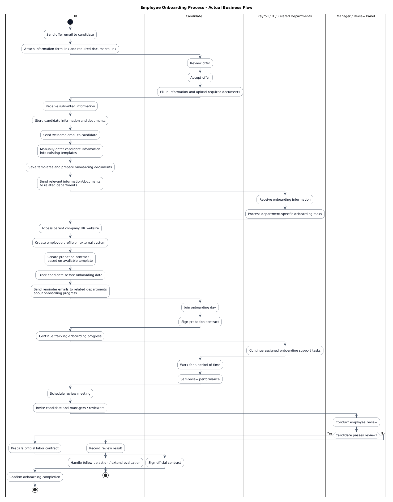
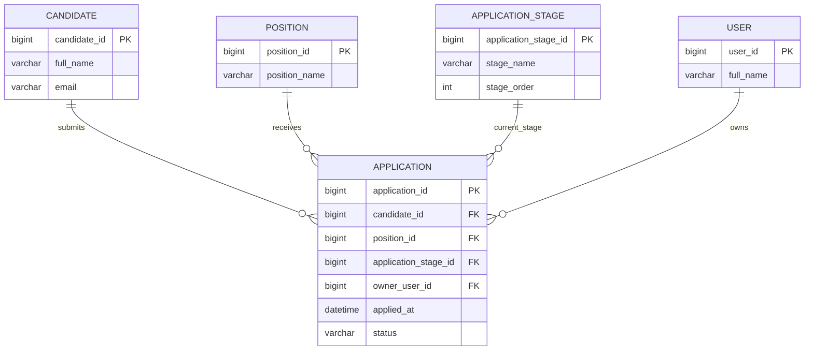
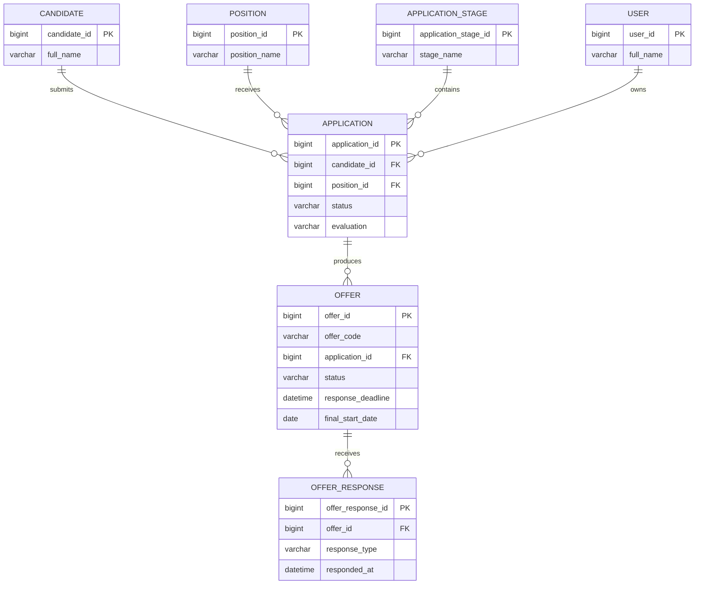
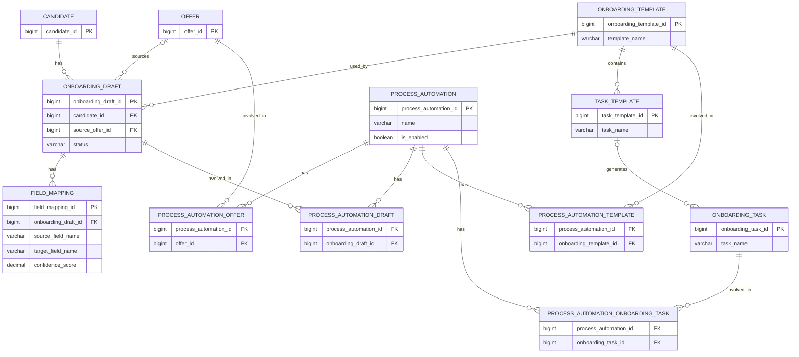
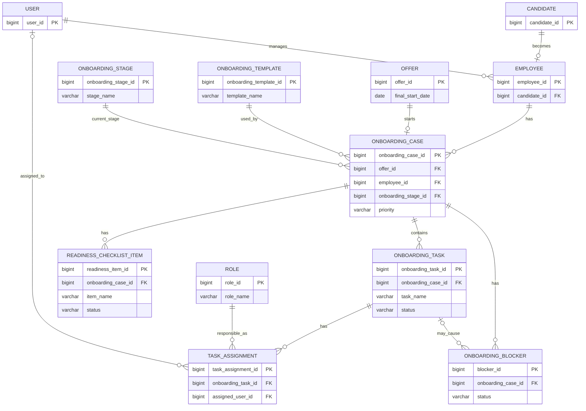
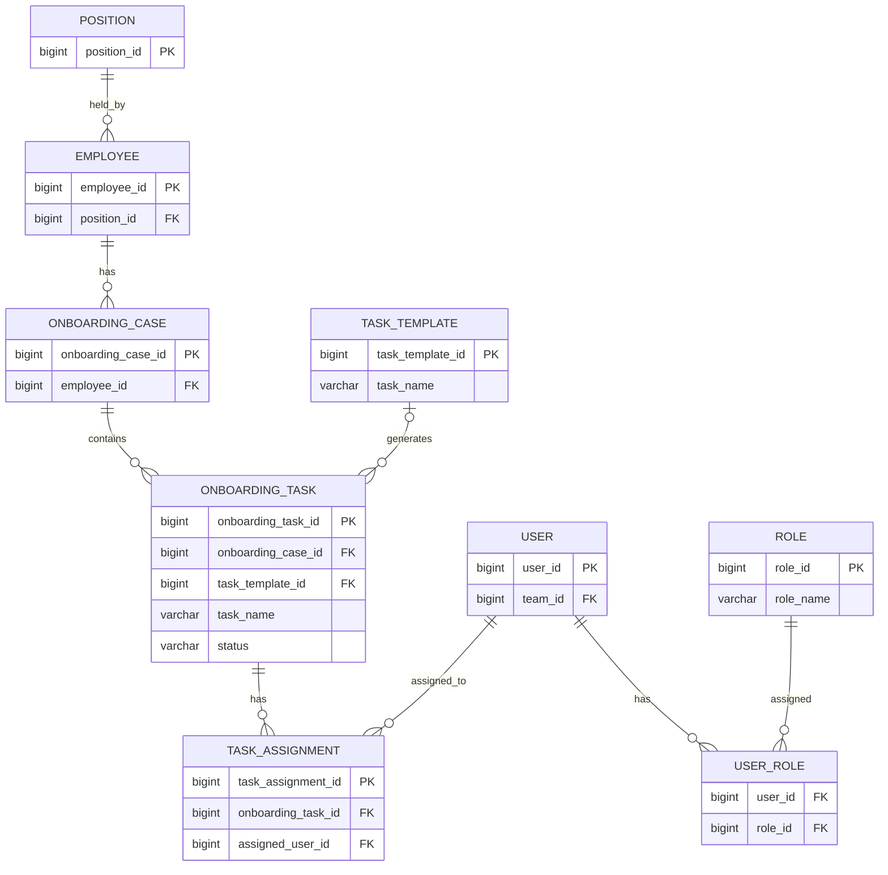
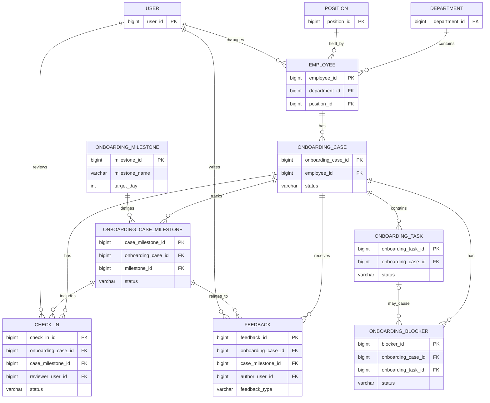

# HR Platform - Onboarding 

# UI/UX

https://www.figma.com/design/zdmEvaHXfHBNyfO5F5zDxh/HR-Platform?node-id=0-1&p=f&t=0EqTrWfMMwvZHJOq-0

# BPMN

### 2. Entity Relationship Diagram (ERD)

```mermaid
erDiagram

    %% ------------------------------------------
    %% 1. CORE SYSTEM & AUTHENTICATION
    %% ------------------------------------------
    DEPARTMENT
    POSITION
    USER
    ROLE
    USER_ROLE

    %% ------------------------------------------
    %% 2. RECRUITMENT & OFFERS
    %% ------------------------------------------
    CANDIDATE
    APPLICATION_STAGE
    APPLICATION
    OFFER
    OFFER_RESPONSE

    %% ------------------------------------------
    %% 3. AUTOMATION HUB & TEMPLATES
    %% ------------------------------------------
    ONBOARDING_TEMPLATE
    TASK_TEMPLATE
    ONBOARDING_DRAFT
    FIELD_MAPPING
    PROCESS_AUTOMATION
    PROCESS_AUTOMATION_OFFER
    PROCESS_AUTOMATION_DRAFT
    PROCESS_AUTOMATION_TEMPLATE
    PROCESS_AUTOMATION_ONBOARDING_TASK

    %% ------------------------------------------
    %% 4. EMPLOYEES & ONBOARDING EXECUTION
    %% ------------------------------------------
    EMPLOYEE
    ONBOARDING_STAGE
    ONBOARDING_CASE

    %% ------------------------------------------
    %% 5. TASKS & ASSIGNMENTS
    %% ------------------------------------------
    ONBOARDING_TASK
    TASK_ASSIGNMENT
    READINESS_CHECKLIST_ITEM

    %% ------------------------------------------
    %% 6. TRACKING & FEEDBACK
    %% ------------------------------------------
    ONBOARDING_MILESTONE
    ONBOARDING_CASE_MILESTONE
    CHECK_IN
    FEEDBACK
    ONBOARDING_BLOCKER

    %% ==========================================
    %% RELATIONSHIPS
    %% ==========================================
    DEPARTMENT ||--o{ EMPLOYEE : "contains"
    POSITION ||--o{ EMPLOYEE : "held_by"
    USER ||--o{ EMPLOYEE : "manages"
    USER ||--o{ USER_ROLE : "has"
    ROLE ||--o{ USER_ROLE : "assigned"

    CANDIDATE ||--o{ APPLICATION : "submits"
    POSITION ||--o{ APPLICATION : "receives"
    APPLICATION_STAGE ||--o{ APPLICATION : "current_stage"
    USER ||--o{ APPLICATION : "owns"

    APPLICATION ||--o{ OFFER : "produces"
    OFFER ||--o{ OFFER_RESPONSE : "receives"

    CANDIDATE ||--o{ ONBOARDING_DRAFT : "has"
    OFFER o|--o{ ONBOARDING_DRAFT : "sources"
    ONBOARDING_TEMPLATE ||--o{ ONBOARDING_DRAFT : "used_by"
    ONBOARDING_TEMPLATE ||--o{ TASK_TEMPLATE : "contains"
    ONBOARDING_DRAFT ||--o{ FIELD_MAPPING : "has"
    TASK_TEMPLATE o|--o{ ONBOARDING_TASK : "generates"

    PROCESS_AUTOMATION ||--o{ PROCESS_AUTOMATION_OFFER : "has"
    OFFER ||--o{ PROCESS_AUTOMATION_OFFER : "involved_in"
    PROCESS_AUTOMATION ||--o{ PROCESS_AUTOMATION_DRAFT : "has"
    ONBOARDING_DRAFT ||--o{ PROCESS_AUTOMATION_DRAFT : "involved_in"
    PROCESS_AUTOMATION ||--o{ PROCESS_AUTOMATION_TEMPLATE : "has"
    ONBOARDING_TEMPLATE ||--o{ PROCESS_AUTOMATION_TEMPLATE : "involved_in"
    PROCESS_AUTOMATION ||--o{ PROCESS_AUTOMATION_ONBOARDING_TASK : "has"
    ONBOARDING_TASK ||--o{ PROCESS_AUTOMATION_ONBOARDING_TASK : "involved_in"

    CANDIDATE ||--o| EMPLOYEE : "becomes"
    EMPLOYEE ||--o{ ONBOARDING_CASE : "has"
    OFFER ||--o| ONBOARDING_CASE : "starts"
    ONBOARDING_TEMPLATE ||--o{ ONBOARDING_CASE : "used_by"
    ONBOARDING_STAGE ||--o{ ONBOARDING_CASE : "current_stage"

    ONBOARDING_CASE ||--o{ ONBOARDING_TASK : "contains"
    ONBOARDING_TASK ||--o{ TASK_ASSIGNMENT : "has"
    ROLE ||--o{ TASK_ASSIGNMENT : "responsible_as"
    USER o|--o{ TASK_ASSIGNMENT : "assigned_to"
    ONBOARDING_CASE ||--o{ READINESS_CHECKLIST_ITEM : "has"

    ONBOARDING_CASE ||--o{ ONBOARDING_CASE_MILESTONE : "tracks"
    ONBOARDING_MILESTONE ||--o{ ONBOARDING_CASE_MILESTONE : "defines"
    ONBOARDING_CASE ||--o{ CHECK_IN : "has"
    ONBOARDING_CASE_MILESTONE ||--o{ CHECK_IN : "includes"
    USER ||--o{ CHECK_IN : "reviews"

    ONBOARDING_CASE ||--o{ FEEDBACK : "receives"
    ONBOARDING_CASE_MILESTONE ||--o{ FEEDBACK : "relates_to"
    USER ||--o{ FEEDBACK : "writes"

    ONBOARDING_CASE ||--o{ ONBOARDING_BLOCKER : "has"
    ONBOARDING_TASK o|--o{ ONBOARDING_BLOCKER : "may_cause"
```

### 3. Core ERD Appllication Management

### 4. Core ERD Offer Management

### 5. Core ERD Intake Review

### 6. Core ERD Onboarding Board 

### 7. Core ERD Assigned Task by Role

### 8. Core ERD Tracking Progress 
