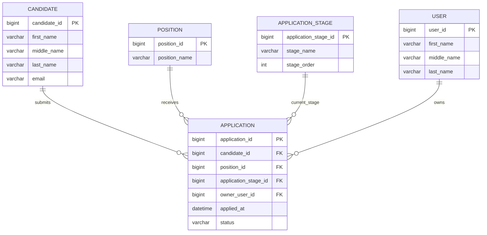

# HR Platform - Onboarding 

# UI/UX

https://www.figma.com/design/tRLTPEG82Vo96X54Rirv4u/Onboarding?node-id=0-1&t=NoMbObpnNXexgxZ0-1

# High Level ERD

```mermaid
flowchart TB
    %% ==========================================
    %% COLOR STYLING SYSTEM
    %% ==========================================
    classDef coreStyle fill:#e0f2fe,stroke:#0284c7,stroke-width:2px,color:#0369a1;
    classDef recruitStyle fill:#dcfce7,stroke:#16a34a,stroke-width:2px,color:#15803d;
    classDef templateStyle fill:#fef9c3,stroke:#ca8a04,stroke-width:2px,color:#a16207;
    classDef onboardingStyle fill:#f3e8ff,stroke:#9333ea,stroke-width:2px,color:#7e22ce;
    classDef taskStyle fill:#ffedd5,stroke:#ea580c,stroke-width:2px,color:#c2410c;
    classDef trackingStyle fill:#ccfbf1,stroke:#0d9488,stroke-width:2px,color:#0f766e;
    classDef notifyStyle fill:#ffe4e6,stroke:#e11d48,stroke-width:2px,color:#be123c;

    %% ==========================================
    %% SUBGRAPHS (MODULES)
    %% ==========================================
    subgraph MODULE_CORE["1. Core System & Auth"]
        DEPARTMENTS:::coreStyle
        POSITIONS:::coreStyle
        USERS:::coreStyle
        ROLES:::coreStyle
        USER_ROLES:::coreStyle
    end

    subgraph MODULE_RECRUIT["2. Recruitment & Offers"]
        CANDIDATES:::recruitStyle
        APPLICATION_STAGES:::recruitStyle
        APPLICATIONS:::recruitStyle
        OFFERS:::recruitStyle
        OFFER_RESPONSES:::recruitStyle
    end

    subgraph MODULE_TEMPLATES["3. Templates & Drafts"]
        ONBOARDING_TEMPLATES:::templateStyle
        TASK_TEMPLATES:::templateStyle
        ONBOARDING_DRAFTS:::templateStyle
    end

    subgraph MODULE_EXECUTION["4. Employee & Execution"]
        EMPLOYEES:::onboardingStyle
        ONBOARDING_STAGES:::onboardingStyle
        ONBOARDING_CASES:::onboardingStyle
    end

    subgraph MODULE_TASKS["5. Tasks & Assignments"]
        ONBOARDING_TASKS:::taskStyle
        TASK_ASSIGNMENTS:::taskStyle
        READINESS_CHECKLIST_ITEMS:::taskStyle
    end

    subgraph MODULE_TRACKING["6. Tracking & Feedback"]
        ONBOARDING_MILESTONES:::trackingStyle
        CHECK_INS:::trackingStyle
        FEEDBACK:::trackingStyle
        ONBOARDING_BLOCKERS:::trackingStyle
    end

    subgraph MODULE_NOTIFY["7. Notifications"]
        NOTIFICATIONS:::notifyStyle
    end

    %% Subgraph Layout Fills
    style MODULE_CORE fill:#f8fafc,stroke:#cbd5e1,stroke-width:1.5px
    style MODULE_RECRUIT fill:#f8fafc,stroke:#cbd5e1,stroke-width:1.5px
    style MODULE_TEMPLATES fill:#f8fafc,stroke:#cbd5e1,stroke-width:1.5px
    style MODULE_EXECUTION fill:#f8fafc,stroke:#cbd5e1,stroke-width:1.5px
    style MODULE_TASKS fill:#f8fafc,stroke:#cbd5e1,stroke-width:1.5px
    style MODULE_TRACKING fill:#f8fafc,stroke:#cbd5e1,stroke-width:1.5px
    style MODULE_NOTIFY fill:#f8fafc,stroke:#cbd5e1,stroke-width:1.5px

    %% ==========================================
    %% RELATIONSHIPS & CARDINALITY
    %% ==========================================
    DEPARTMENTS -- "1 : N (has)" --> USERS
    POSITIONS -- "1 : N (has)" --> USERS
    USERS -- "1 : N (assigned)" --> USER_ROLES
    ROLES -- "1 : N (includes)" --> USER_ROLES

    CANDIDATES -- "1 : N (submits)" --> APPLICATIONS
    POSITIONS -- "1 : N (applies_for)" --> APPLICATIONS
    APPLICATION_STAGES -- "1 : N (current_stage)" --> APPLICATIONS
    USERS -- "1 : N (manages)" --> APPLICATIONS

    APPLICATIONS -- "1 : N (produces)" --> OFFERS
    CANDIDATES -- "1 : N (receives)" --> OFFERS
    USERS -- "1 : N (prepares)" --> OFFERS
    OFFERS -- "1 : N (has)" --> OFFER_RESPONSES

    DEPARTMENTS -- "1 : N (owns)" --> ONBOARDING_TEMPLATES
    ONBOARDING_TEMPLATES -- "1 : N (contains)" --> TASK_TEMPLATES
    ROLES -- "1 : N (assigned_role)" --> TASK_TEMPLATES

    CANDIDATES -- "1 : N (has)" --> ONBOARDING_DRAFTS
    OFFERS -- "1 : 1 (generates)" --> ONBOARDING_DRAFTS
    ONBOARDING_TEMPLATES -- "1 : N (uses)" --> ONBOARDING_DRAFTS
    USERS -- "1 : N (reviews)" --> ONBOARDING_DRAFTS

    CANDIDATES -- "1 : 1 (becomes)" --> EMPLOYEES
    DEPARTMENTS -- "1 : N (belongs_to)" --> EMPLOYEES
    POSITIONS -- "1 : N (holds)" --> EMPLOYEES
    USERS -- "1 : N (manages)" --> EMPLOYEES

    CANDIDATES -- "1 : N (enters)" --> ONBOARDING_CASES
    OFFERS -- "1 : 1 (starts)" --> ONBOARDING_CASES
    EMPLOYEES -- "1 : 1 (created_for)" --> ONBOARDING_CASES
    ONBOARDING_TEMPLATES -- "1 : N (based_on)" --> ONBOARDING_CASES
    ONBOARDING_STAGES -- "1 : N (current_stage)" --> ONBOARDING_CASES
    USERS -- "1 : N (creates)" --> ONBOARDING_CASES

    ONBOARDING_CASES -- "1 : N (contains)" --> ONBOARDING_TASKS
    TASK_TEMPLATES -- "1 : N (generates)" --> ONBOARDING_TASKS

    ONBOARDING_TASKS -- "1 : N (has)" --> TASK_ASSIGNMENTS
    USERS -- "1 : N (assigned_to)" --> TASK_ASSIGNMENTS
    ROLES -- "1 : N (assigned_role)" --> TASK_ASSIGNMENTS

    ONBOARDING_CASES -- "1 : N (has)" --> READINESS_CHECKLIST_ITEMS
    ONBOARDING_TASKS -- "1 : N (satisfies)" --> READINESS_CHECKLIST_ITEMS

    ONBOARDING_CASES -- "1 : N (tracks)" --> ONBOARDING_MILESTONES

    ONBOARDING_CASES -- "1 : N (has)" --> CHECK_INS
    ONBOARDING_MILESTONES -- "1 : N (includes)" --> CHECK_INS
    USERS -- "1 : N (creates)" --> CHECK_INS

    ONBOARDING_CASES -- "1 : N (has)" --> FEEDBACK
    ONBOARDING_MILESTONES -- "1 : N (relates_to)" --> FEEDBACK
    USERS -- "1 : N (writes)" --> FEEDBACK

    ONBOARDING_CASES -- "1 : N (has)" --> ONBOARDING_BLOCKERS
    ONBOARDING_TASKS -- "1 : N (related_to)" --> ONBOARDING_BLOCKERS
    USERS -- "1 : N (reports)" --> ONBOARDING_BLOCKERS

    USERS -- "1 : N (receives)" --> NOTIFICATIONS
    ONBOARDING_CASES -- "1 : N (triggers)" --> NOTIFICATIONS
    ONBOARDING_TASKS -- "1 : N (related_to)" --> NOTIFICATIONS
```

---

### 2. Entity Relationship Diagram (ERD)

```mermaid
erDiagram

    %% ------------------------------------------
    %% 1. CORE SYSTEM & AUTHENTICATION
    %% ------------------------------------------
    DEPARTMENTS
    POSITIONS
    USERS
    ROLES
    USER_ROLES

    %% ------------------------------------------
    %% 2. RECRUITMENT & OFFERS
    %% ------------------------------------------
    CANDIDATES
    APPLICATION_STAGES
    APPLICATIONS
    OFFERS
    OFFER_RESPONSES

    %% ------------------------------------------
    %% 3. ONBOARDING TEMPLATES & DRAFTS
    %% ------------------------------------------
    ONBOARDING_TEMPLATES
    TASK_TEMPLATES
    ONBOARDING_DRAFTS

    %% ------------------------------------------
    %% 4. EMPLOYEES & ONBOARDING EXECUTION
    %% ------------------------------------------
    EMPLOYEES
    ONBOARDING_STAGES
    ONBOARDING_CASES

    %% ------------------------------------------
    %% 5. TASKS, ASSIGNMENTS & CHECKLISTS
    %% ------------------------------------------
    ONBOARDING_TASKS
    TASK_ASSIGNMENTS
    READINESS_CHECKLIST_ITEMS

    %% ------------------------------------------
    %% 6. TRACKING, MILESTONES & FEEDBACK
    %% ------------------------------------------
    ONBOARDING_MILESTONES
    CHECK_INS
    FEEDBACK
    ONBOARDING_BLOCKERS

    %% ------------------------------------------
    %% 7. NOTIFICATIONS
    %% ------------------------------------------
    NOTIFICATIONS

    %% ==========================================
    %% RELATIONSHIPS
    %% ==========================================
    DEPARTMENTS ||--o{ USERS : "has"
    POSITIONS ||--o{ USERS : "has"
    USERS ||--o{ USER_ROLES : "assigned"
    ROLES ||--o{ USER_ROLES : "includes"

    CANDIDATES ||--o{ APPLICATIONS : "submits"
    POSITIONS ||--o{ APPLICATIONS : "applies_for"
    APPLICATION_STAGES ||--o{ APPLICATIONS : "current_stage"
    USERS ||--o{ APPLICATIONS : "manages"

    APPLICATIONS ||--o{ OFFERS : "produces"
    CANDIDATES ||--o{ OFFERS : "receives"
    USERS ||--o{ OFFERS : "prepares"
    OFFERS ||--o{ OFFER_RESPONSES : "has"

    DEPARTMENTS ||--o{ ONBOARDING_TEMPLATES : "owns"
    ONBOARDING_TEMPLATES ||--o{ TASK_TEMPLATES : "contains"
    ROLES ||--o{ TASK_TEMPLATES : "assigned_role"

    CANDIDATES ||--o{ ONBOARDING_DRAFTS : "has"
    OFFERS ||--o| ONBOARDING_DRAFTS : "generates"
    ONBOARDING_TEMPLATES ||--o{ ONBOARDING_DRAFTS : "uses"
    USERS ||--o{ ONBOARDING_DRAFTS : "reviews"

    CANDIDATES ||--o| EMPLOYEES : "becomes"
    DEPARTMENTS ||--o{ EMPLOYEES : "belongs_to"
    POSITIONS ||--o{ EMPLOYEES : "holds"
    USERS ||--o{ EMPLOYEES : "manages"

    CANDIDATES ||--o{ ONBOARDING_CASES : "enters"
    OFFERS ||--o| ONBOARDING_CASES : "starts"
    EMPLOYEES ||--o| ONBOARDING_CASES : "created_for"
    ONBOARDING_TEMPLATES ||--o{ ONBOARDING_CASES : "based_on"
    ONBOARDING_STAGES ||--o{ ONBOARDING_CASES : "current_stage"
    USERS ||--o{ ONBOARDING_CASES : "creates"

    ONBOARDING_CASES ||--o{ ONBOARDING_TASKS : "contains"
    TASK_TEMPLATES ||--o{ ONBOARDING_TASKS : "generates"

    ONBOARDING_TASKS ||--o{ TASK_ASSIGNMENTS : "has"
    USERS ||--o{ TASK_ASSIGNMENTS : "assigned_to"
    ROLES ||--o{ TASK_ASSIGNMENTS : "assigned_role"

    ONBOARDING_CASES ||--o{ READINESS_CHECKLIST_ITEMS : "has"
    ONBOARDING_TASKS ||--o{ READINESS_CHECKLIST_ITEMS : "satisfies"

    ONBOARDING_CASES ||--o{ ONBOARDING_MILESTONES : "tracks"

    ONBOARDING_CASES ||--o{ CHECK_INS : "has"
    ONBOARDING_MILESTONES ||--o{ CHECK_INS : "includes"
    USERS ||--o{ CHECK_INS : "creates"

    ONBOARDING_CASES ||--o{ FEEDBACK : "has"
    ONBOARDING_MILESTONES ||--o{ FEEDBACK : "relates_to"
    USERS ||--o{ FEEDBACK : "writes"

    ONBOARDING_CASES ||--o{ ONBOARDING_BLOCKERS : "has"
    ONBOARDING_TASKS ||--o{ ONBOARDING_BLOCKERS : "related_to"
    USERS ||--o{ ONBOARDING_BLOCKERS : "reports"

    USERS ||--o{ NOTIFICATIONS : "receives"
    ONBOARDING_CASES ||--o{ NOTIFICATIONS : "triggers"
    ONBOARDING_TASKS ||--o{ NOTIFICATIONS : "related_to"
```

### 3. Core ERD Appllication Management

