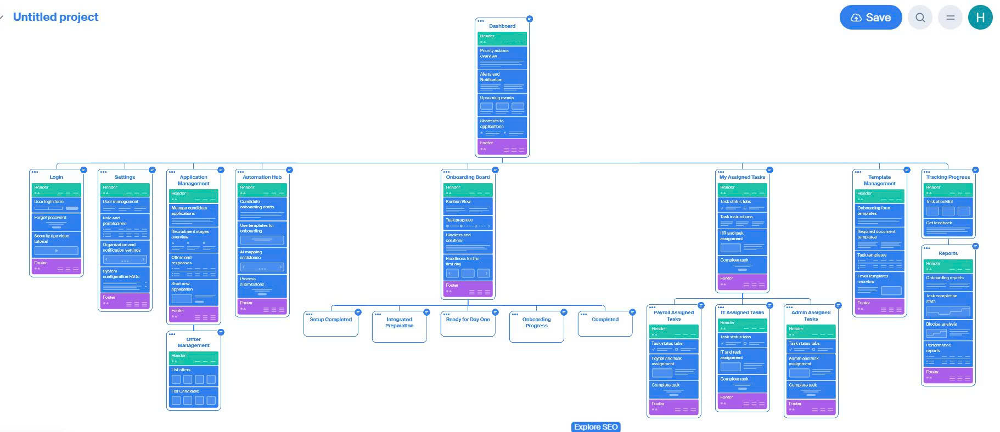
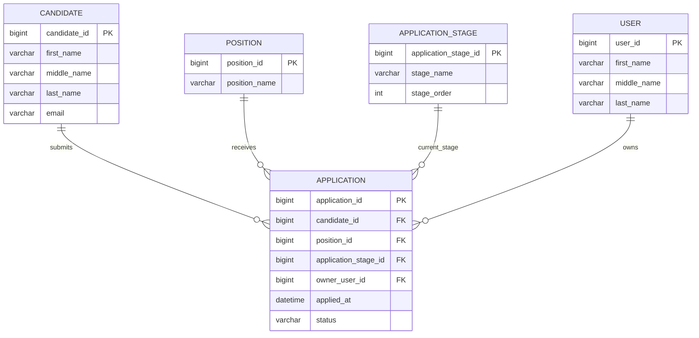
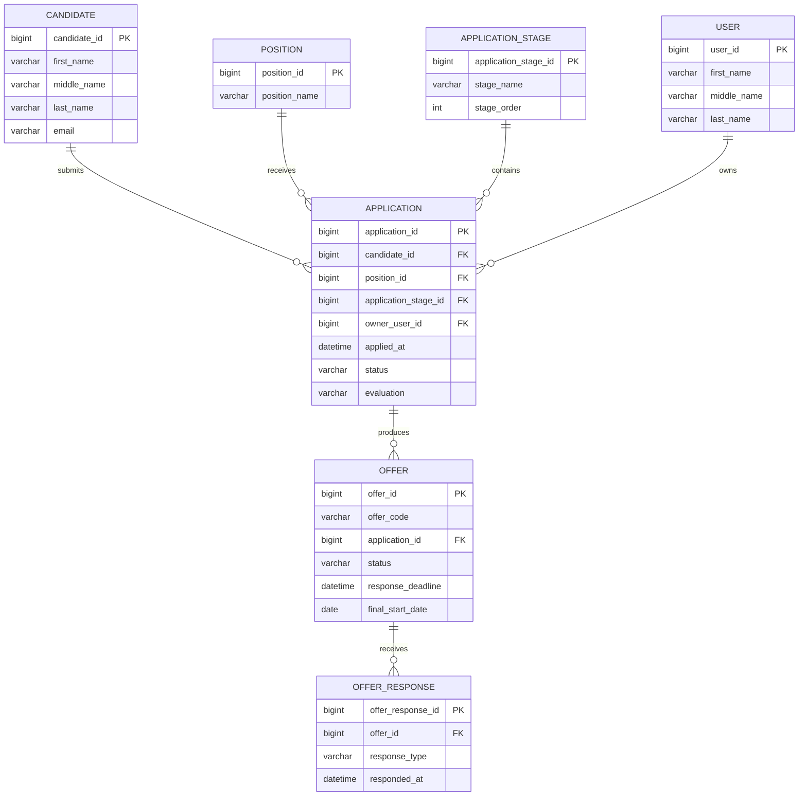
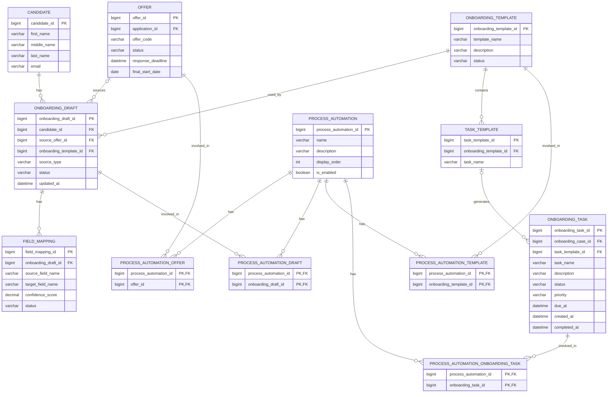
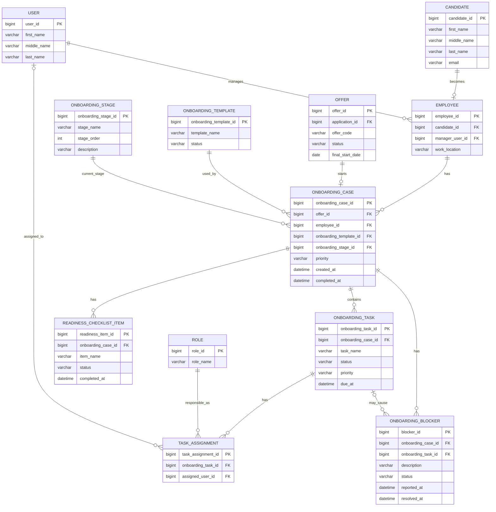
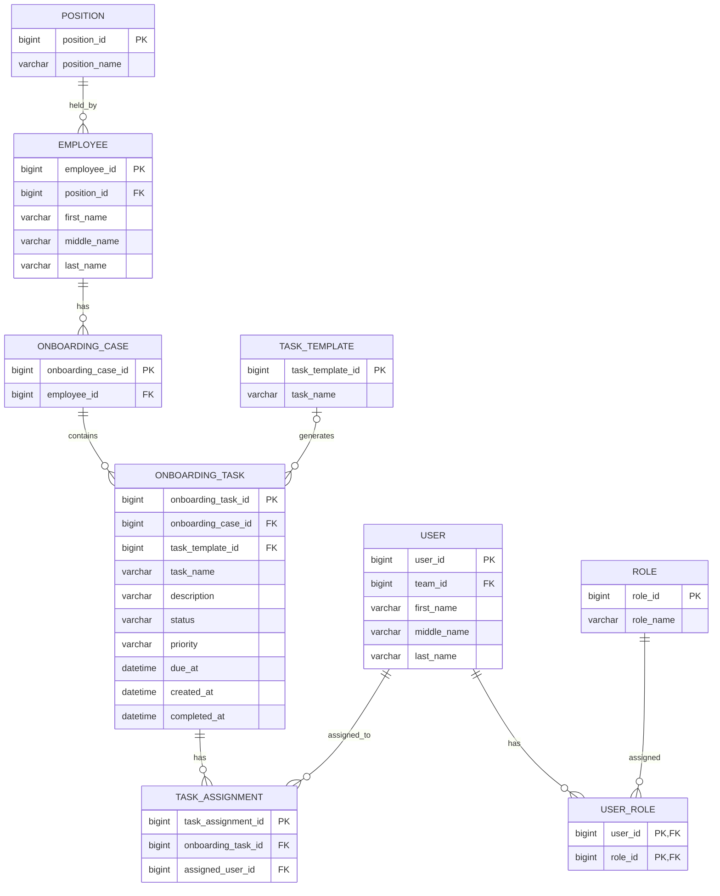
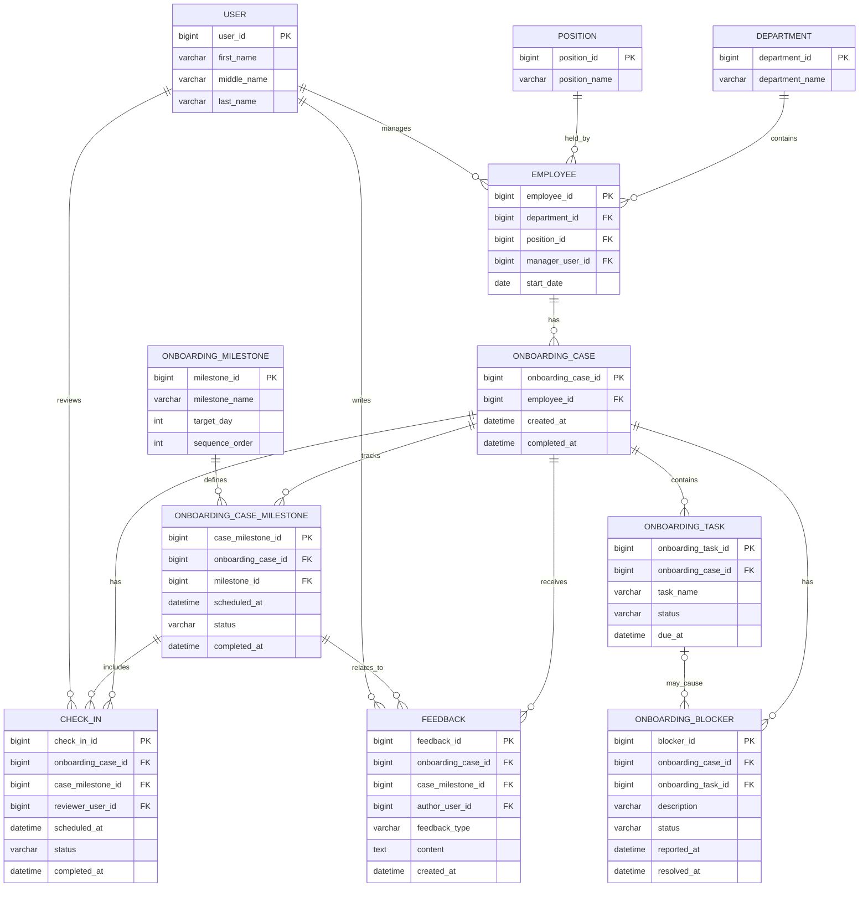

# HR Platform - Onboarding 

# UI/UX

https://www.figma.com/design/tRLTPEG82Vo96X54Rirv4u/Onboarding?node-id=0-1&t=NoMbObpnNXexgxZ0-1

# High Level ERD

```mermaid
flowchart TB
    %% ==========================================
    %% COLOR STYLING SYSTEM
    %% ==========================================
    classDef coreStyle fill:#e0f2fe,stroke:#0284c7,stroke-width:2px,color:#0369a1;
    classDef recruitStyle fill:#dcfce7,stroke:#16a34a,stroke-width:2px,color:#15803d;
    classDef templateStyle fill:#fef9c3,stroke:#ca8a04,stroke-width:2px,color:#a16207;
    classDef onboardingStyle fill:#f3e8ff,stroke:#9333ea,stroke-width:2px,color:#7e22ce;
    classDef taskStyle fill:#ffedd5,stroke:#ea580c,stroke-width:2px,color:#c2410c;
    classDef trackingStyle fill:#ccfbf1,stroke:#0d9488,stroke-width:2px,color:#0f766e;

    %% ==========================================
    %% SUBGRAPHS (MODULES)
    %% ==========================================
    subgraph MODULE_CORE["1. Core System & Auth"]
        DEPARTMENT:::coreStyle
        POSITION:::coreStyle
        USER:::coreStyle
        ROLE:::coreStyle
        USER_ROLE:::coreStyle
    end

    subgraph MODULE_RECRUIT["2. Recruitment & Offers"]
        CANDIDATE:::recruitStyle
        APPLICATION_STAGE:::recruitStyle
        APPLICATION:::recruitStyle
        OFFER:::recruitStyle
        OFFER_RESPONSE:::recruitStyle
    end

    subgraph MODULE_TEMPLATES["3. Automation Hub & Templates"]
        ONBOARDING_TEMPLATE:::templateStyle
        TASK_TEMPLATE:::templateStyle
        ONBOARDING_DRAFT:::templateStyle
        FIELD_MAPPING:::templateStyle
        PROCESS_AUTOMATION:::templateStyle
        PROCESS_AUTOMATION_OFFER:::templateStyle
        PROCESS_AUTOMATION_DRAFT:::templateStyle
        PROCESS_AUTOMATION_TEMPLATE:::templateStyle
        PROCESS_AUTOMATION_ONBOARDING_TASK:::templateStyle
    end

    subgraph MODULE_EXECUTION["4. Employee & Execution"]
        EMPLOYEE:::onboardingStyle
        ONBOARDING_STAGE:::onboardingStyle
        ONBOARDING_CASE:::onboardingStyle
    end

    subgraph MODULE_TASKS["5. Tasks & Assignments"]
        ONBOARDING_TASK:::taskStyle
        TASK_ASSIGNMENT:::taskStyle
        READINESS_CHECKLIST_ITEM:::taskStyle
    end

    subgraph MODULE_TRACKING["6. Tracking & Feedback"]
        ONBOARDING_MILESTONE:::trackingStyle
        ONBOARDING_CASE_MILESTONE:::trackingStyle
        CHECK_IN:::trackingStyle
        FEEDBACK:::trackingStyle
        ONBOARDING_BLOCKER:::trackingStyle
    end

    %% Subgraph Layout Fills
    style MODULE_CORE fill:#f8fafc,stroke:#cbd5e1,stroke-width:1.5px
    style MODULE_RECRUIT fill:#f8fafc,stroke:#cbd5e1,stroke-width:1.5px
    style MODULE_TEMPLATES fill:#f8fafc,stroke:#cbd5e1,stroke-width:1.5px
    style MODULE_EXECUTION fill:#f8fafc,stroke:#cbd5e1,stroke-width:1.5px
    style MODULE_TASKS fill:#f8fafc,stroke:#cbd5e1,stroke-width:1.5px
    style MODULE_TRACKING fill:#f8fafc,stroke:#cbd5e1,stroke-width:1.5px

    %% ==========================================
    %% RELATIONSHIPS & CARDINALITY
    %% ==========================================
    DEPARTMENT -- "1 : N" --> EMPLOYEE
    POSITION -- "1 : N" --> EMPLOYEE
    USER -- "1 : N" --> EMPLOYEE
    USER -- "1 : N" --> USER_ROLE
    ROLE -- "1 : N" --> USER_ROLE

    CANDIDATE -- "1 : N" --> APPLICATION
    POSITION -- "1 : N" --> APPLICATION
    APPLICATION_STAGE -- "1 : N" --> APPLICATION
    USER -- "1 : N" --> APPLICATION

    APPLICATION -- "1 : N" --> OFFER
    OFFER -- "1 : N" --> OFFER_RESPONSE

    CANDIDATE -- "1 : N" --> ONBOARDING_DRAFT
    OFFER -- "1 : N" --> ONBOARDING_DRAFT
    ONBOARDING_TEMPLATE -- "1 : N" --> ONBOARDING_DRAFT
    ONBOARDING_TEMPLATE -- "1 : N" --> TASK_TEMPLATE
    ONBOARDING_DRAFT -- "1 : N" --> FIELD_MAPPING
    TASK_TEMPLATE -- "1 : N" --> ONBOARDING_TASK

    PROCESS_AUTOMATION -- "1 : N" --> PROCESS_AUTOMATION_OFFER
    OFFER -- "1 : N" --> PROCESS_AUTOMATION_OFFER
    PROCESS_AUTOMATION -- "1 : N" --> PROCESS_AUTOMATION_DRAFT
    ONBOARDING_DRAFT -- "1 : N" --> PROCESS_AUTOMATION_DRAFT
    PROCESS_AUTOMATION -- "1 : N" --> PROCESS_AUTOMATION_TEMPLATE
    ONBOARDING_TEMPLATE -- "1 : N" --> PROCESS_AUTOMATION_TEMPLATE
    PROCESS_AUTOMATION -- "1 : N" --> PROCESS_AUTOMATION_ONBOARDING_TASK
    ONBOARDING_TASK -- "1 : N" --> PROCESS_AUTOMATION_ONBOARDING_TASK

    CANDIDATE -- "1 : 1" --> EMPLOYEE
    EMPLOYEE -- "1 : N" --> ONBOARDING_CASE
    OFFER -- "1 : 1" --> ONBOARDING_CASE
    ONBOARDING_TEMPLATE -- "1 : N" --> ONBOARDING_CASE
    ONBOARDING_STAGE -- "1 : N" --> ONBOARDING_CASE

    ONBOARDING_CASE -- "1 : N" --> ONBOARDING_TASK
    ONBOARDING_TASK -- "1 : N" --> TASK_ASSIGNMENT
    ROLE -- "1 : N" --> TASK_ASSIGNMENT
    USER -- "1 : N" --> TASK_ASSIGNMENT
    ONBOARDING_CASE -- "1 : N" --> READINESS_CHECKLIST_ITEM

    ONBOARDING_CASE -- "1 : N" --> ONBOARDING_CASE_MILESTONE
    ONBOARDING_MILESTONE -- "1 : N" --> ONBOARDING_CASE_MILESTONE
    ONBOARDING_CASE -- "1 : N" --> CHECK_IN
    ONBOARDING_CASE_MILESTONE -- "1 : N" --> CHECK_IN
    USER -- "1 : N" --> CHECK_IN

    ONBOARDING_CASE -- "1 : N" --> FEEDBACK
    ONBOARDING_CASE_MILESTONE -- "1 : N" --> FEEDBACK
    USER -- "1 : N" --> FEEDBACK

    ONBOARDING_CASE -- "1 : N" --> ONBOARDING_BLOCKER
    ONBOARDING_TASK -- "1 : N" --> ONBOARDING_BLOCKER
```

---

### 2. Entity Relationship Diagram (ERD)

```mermaid
erDiagram

    %% ------------------------------------------
    %% 1. CORE SYSTEM & AUTHENTICATION
    %% ------------------------------------------
    DEPARTMENT
    POSITION
    USER
    ROLE
    USER_ROLE

    %% ------------------------------------------
    %% 2. RECRUITMENT & OFFERS
    %% ------------------------------------------
    CANDIDATE
    APPLICATION_STAGE
    APPLICATION
    OFFER
    OFFER_RESPONSE

    %% ------------------------------------------
    %% 3. AUTOMATION HUB & TEMPLATES
    %% ------------------------------------------
    ONBOARDING_TEMPLATE
    TASK_TEMPLATE
    ONBOARDING_DRAFT
    FIELD_MAPPING
    PROCESS_AUTOMATION
    PROCESS_AUTOMATION_OFFER
    PROCESS_AUTOMATION_DRAFT
    PROCESS_AUTOMATION_TEMPLATE
    PROCESS_AUTOMATION_ONBOARDING_TASK

    %% ------------------------------------------
    %% 4. EMPLOYEES & ONBOARDING EXECUTION
    %% ------------------------------------------
    EMPLOYEE
    ONBOARDING_STAGE
    ONBOARDING_CASE

    %% ------------------------------------------
    %% 5. TASKS & ASSIGNMENTS
    %% ------------------------------------------
    ONBOARDING_TASK
    TASK_ASSIGNMENT
    READINESS_CHECKLIST_ITEM

    %% ------------------------------------------
    %% 6. TRACKING & FEEDBACK
    %% ------------------------------------------
    ONBOARDING_MILESTONE
    ONBOARDING_CASE_MILESTONE
    CHECK_IN
    FEEDBACK
    ONBOARDING_BLOCKER

    %% ==========================================
    %% RELATIONSHIPS
    %% ==========================================
    DEPARTMENT ||--o{ EMPLOYEE : "contains"
    POSITION ||--o{ EMPLOYEE : "held_by"
    USER ||--o{ EMPLOYEE : "manages"
    USER ||--o{ USER_ROLE : "has"
    ROLE ||--o{ USER_ROLE : "assigned"

    CANDIDATE ||--o{ APPLICATION : "submits"
    POSITION ||--o{ APPLICATION : "receives"
    APPLICATION_STAGE ||--o{ APPLICATION : "current_stage"
    USER ||--o{ APPLICATION : "owns"

    APPLICATION ||--o{ OFFER : "produces"
    OFFER ||--o{ OFFER_RESPONSE : "receives"

    CANDIDATE ||--o{ ONBOARDING_DRAFT : "has"
    OFFER o|--o{ ONBOARDING_DRAFT : "sources"
    ONBOARDING_TEMPLATE ||--o{ ONBOARDING_DRAFT : "used_by"
    ONBOARDING_TEMPLATE ||--o{ TASK_TEMPLATE : "contains"
    ONBOARDING_DRAFT ||--o{ FIELD_MAPPING : "has"
    TASK_TEMPLATE o|--o{ ONBOARDING_TASK : "generates"

    PROCESS_AUTOMATION ||--o{ PROCESS_AUTOMATION_OFFER : "has"
    OFFER ||--o{ PROCESS_AUTOMATION_OFFER : "involved_in"
    PROCESS_AUTOMATION ||--o{ PROCESS_AUTOMATION_DRAFT : "has"
    ONBOARDING_DRAFT ||--o{ PROCESS_AUTOMATION_DRAFT : "involved_in"
    PROCESS_AUTOMATION ||--o{ PROCESS_AUTOMATION_TEMPLATE : "has"
    ONBOARDING_TEMPLATE ||--o{ PROCESS_AUTOMATION_TEMPLATE : "involved_in"
    PROCESS_AUTOMATION ||--o{ PROCESS_AUTOMATION_ONBOARDING_TASK : "has"
    ONBOARDING_TASK ||--o{ PROCESS_AUTOMATION_ONBOARDING_TASK : "involved_in"

    CANDIDATE ||--o| EMPLOYEE : "becomes"
    EMPLOYEE ||--o{ ONBOARDING_CASE : "has"
    OFFER ||--o| ONBOARDING_CASE : "starts"
    ONBOARDING_TEMPLATE ||--o{ ONBOARDING_CASE : "used_by"
    ONBOARDING_STAGE ||--o{ ONBOARDING_CASE : "current_stage"

    ONBOARDING_CASE ||--o{ ONBOARDING_TASK : "contains"
    ONBOARDING_TASK ||--o{ TASK_ASSIGNMENT : "has"
    ROLE ||--o{ TASK_ASSIGNMENT : "responsible_as"
    USER o|--o{ TASK_ASSIGNMENT : "assigned_to"
    ONBOARDING_CASE ||--o{ READINESS_CHECKLIST_ITEM : "has"

    ONBOARDING_CASE ||--o{ ONBOARDING_CASE_MILESTONE : "tracks"
    ONBOARDING_MILESTONE ||--o{ ONBOARDING_CASE_MILESTONE : "defines"
    ONBOARDING_CASE ||--o{ CHECK_IN : "has"
    ONBOARDING_CASE_MILESTONE ||--o{ CHECK_IN : "includes"
    USER ||--o{ CHECK_IN : "reviews"

    ONBOARDING_CASE ||--o{ FEEDBACK : "receives"
    ONBOARDING_CASE_MILESTONE ||--o{ FEEDBACK : "relates_to"
    USER ||--o{ FEEDBACK : "writes"

    ONBOARDING_CASE ||--o{ ONBOARDING_BLOCKER : "has"
    ONBOARDING_TASK o|--o{ ONBOARDING_BLOCKER : "may_cause"
```

### 3. Core ERD Appllication Management

### 4. Core ERD Offer Management

### 5. Core ERD Automation Hub

### 6. Core ERD Onboarding Board 

### 7. Core ERD Assigned Task by Role

### 8. Core ERD Tracking Progress 
